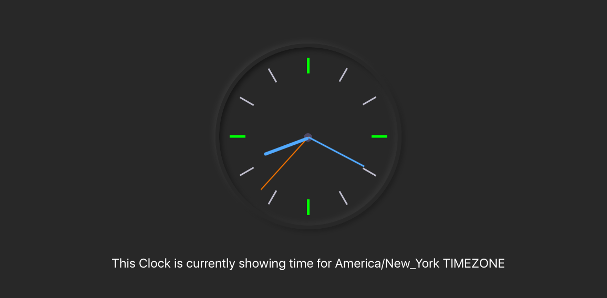

<h1 align=center> **Analogue Clock ** </h1>

[](https://github.com/RichardLitt/standard-readme)
[](https://david-dm.org/dwyl/esta)

This project is an Analogue Clock that display time from a time api base on given timezone. this project was designed using React and TypeScript.




## Background

- React
- React-DOM
- React-Create-App
- Redux
- react-redux
- TypeScript
- CSS
- ES6


## Usage

> Clone the repository to your local machine

```sh
$ git clone https://github.com/macbright/clock.git
```

> cd into the directory

```sh
$ cd clock
```

> install the npm packages

```sh
$ npm install
```

> use npm or yarn to start the server (note: you must have npm and yarn install)

```sh
$ yarn start
```
OR

```sh
$ npm run start
```
this runs the app in the development mode.<br />
Open [http://localhost:3000](http://localhost:3000) to view it in the browser.

The page will reload if you make edits.<br />
You will also see any lint errors in the console.


## Maintainers 

👤  **Bright Okike**

- Github: [@macbright](https://github.com/macbright)
- LinkedIn: [@bokike](https://www.linkedin.com/in/bokike/)
- Twitter: [@b_okike](https://twitter.com/b_okike)
  


## Future Features
1. enable user to select a particular timezone and display the time base on the selected timezone

## Contributing

1. Fork it (https://github.com/macbright/react-book-store.git)
2. Create your feature branch (git checkout -b feature/[choose-a-name])
3. Commit your changes (git commit -am 'What this commit will fix/add')
4. Push to the branch (git push origin feature/[chosen name])
5. Create a new Pull Request

## License

Bright okike
[MIT license](https://opensource.org/licenses/MIT).
